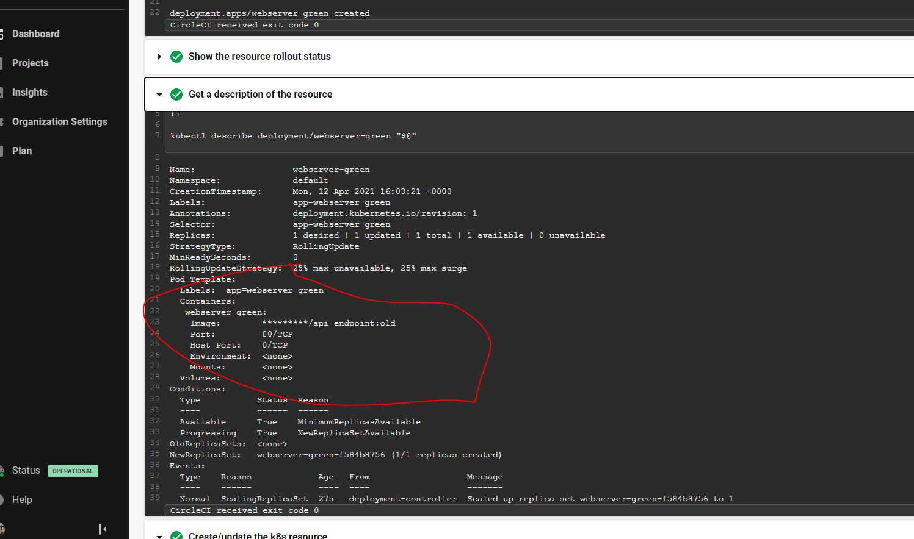
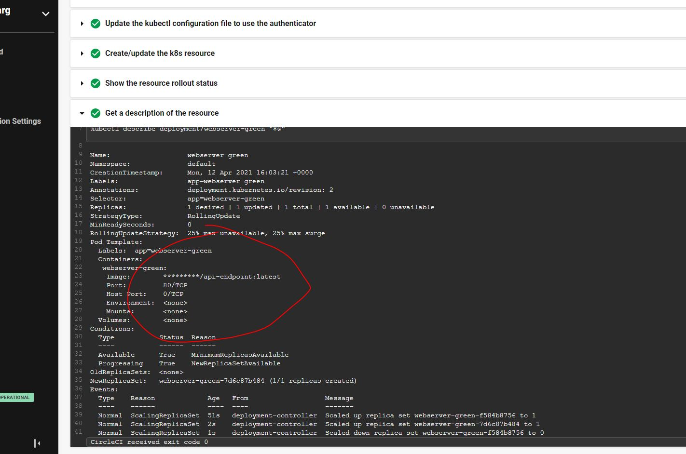

# Cloud DevOps Engineer Capstone Project

 Final project of the DevOps Udacity Nanodegree

## Introduction

In this project I will apply the skills and knowledge which were developed throughout the Cloud DevOps Nanodegree program. These include:

- Working in AWS
- Using CircleCI to implement Continuous Integration and Continuous Deployment
- Building pipelines
- Using EKS CircleCI Orb to deploy clusters
- Building Kubernetes clusters
- Building Docker containers in pipelines

## Application

In this capstone, we will reuse the Python app used in project #4 to that implements ML to make predictions, and publish a Flask API:

```
kubernetes manifest files in /kubernetes folder. 
```

Application brief explanation.

## Kubernetes Cluster

The EKS Orb is used to deploy the Kubernetes Cluster. The code is in `cloudformation` directory. It is divided in two stacks, one for the deployment (kube-deployment-blue/green.yml) and a second one for the loadbalancer service (service-green/blue.yml).

This will create the stack in the following order:

1. VPC in eu-east-1.
2. Internet Gateway attached to the VPC.
3. Two public subnets in different AZs.
4. Public route table associated with the two public subnets.
5. Security group for the cluster.
6. Kubernetes cluster.
7. Kubernetes node group.


## CircleCI Pipeline

I am using a CI/CD pipeline on a rollout deployment. On each new deployment generated, the docker image is updated, an "old" and "latest" version pushed to DockerHub and the Kubernetes pods are deployed so they start with the old image from the repository. Then, the image is updated during the rollout step to "latest". There is a load balancer before the exposed 80 TCP ports to avoid having downtime. These are the steps in more detail:

<<pic here>>

1. <<app>> Reqs.

The script's Python requirements are installed. They include <<reqs>>.

```
pip3 install -r requirements.txt
```

2. Python Lint

Check the script's code with pylint. 

```
pylint --disable=R,C,W1203,W1309 app.py
```

This is the output when LINT fails:


And this is the output when LINT passes:


  
3. Run App

the webpage is operational

```
python3 app.py
```

4. Build & Push

The docker image is build using the Dockerfile and the image is pushed to Docker Hub, I push an "old" and "latest" to perform the rollout later:

```
            docker build -t pato23arg/api-endpoint:${CIRCLE_WORKFLOW_ID} .
            docker build -t pato23arg/api-endpoint:old .
            docker login -u ${DOCKER_LOGIN} -p ${DOCKER_PASSWORD}
            docker push pato23arg/api-endpoint:${CIRCLE_WORKFLOW_ID}
            docker push pato23arg/api-endpoint:old
```

6. The K8S cluster is deployed in EKS:

A EKS cluster is deployed in AWS:

```
      - aws-eks/create-cluster:
          requires: [build-and-lint]
          aws-region: ${AWS_DEFAULT_REGION}
          cluster-name: k8s-${CIRCLE_WORKFLOW_ID}
```

6. Cluster test

The Kubernetes services are checked:

```
kubectl get services
```

7. Green Server Deployment

Deploy the pods to use the new pushed image.

```
      - aws-eks/update-kubeconfig-with-authenticator:
          cluster-name: << pipeline.parameters.cluster-name >>
          install-kubectl: true
      - kubernetes/create-or-update-resource:
          get-rollout-status: true
          resource-file-path: kubernetes/deployment-green.yml
          resource-name: deployment/api-endpoint-green
      - kubernetes/create-or-update-resource:
          resource-file-path: kubernetes/service-green.yml
```





8. Rollout Deployments

After creation, the Deployment is rolled out to update the docker image, this process restarts the Deployment:

```
      - aws-eks/update-kubeconfig-with-authenticator:
          cluster-name: << pipeline.parameters.cluster-name >>
          install-kubectl: true
      - kubernetes/create-or-update-resource:
          get-rollout-status: true
          resource-file-path: "kubernetes/rollout-green.yml"
          resource-name: deployment/webserver-green
          
```


## View the public web page

Finally, enter the public DNS record in the web browser to access the page.

```
$ kubectl get deployment
NAME        READY   UP-TO-DATE   AVAILABLE   AGE
webserver-blue   1/1     1            1           7m30s
webserver-green   1/1     1            1           7m30s
$ kubectl get service
NAME           TYPE           CLUSTER-IP    EXTERNAL-IP                                                              PORT(S)        AGE
kubernetes     ClusterIP      172.20.0.1    <none>                                                                   443/TCP        19m
loadbalancer-blue   LoadBalancer   172.20.75.5   <<service-url>>   80:31022/TCP   
```

<< app webpage >>
